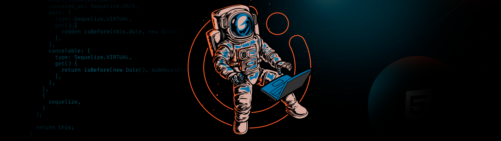

## Maratona Explorer - Rocketseat

Uma semana de aulas sobre os fundamentos da programação, dicas de estudo e guias de carreira. Durante a maratona é desenvolvido um app de "advinhação do futuro" utilizando HTML, CSS e JavaScript.
